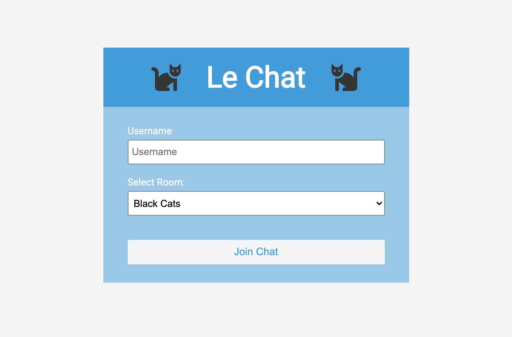
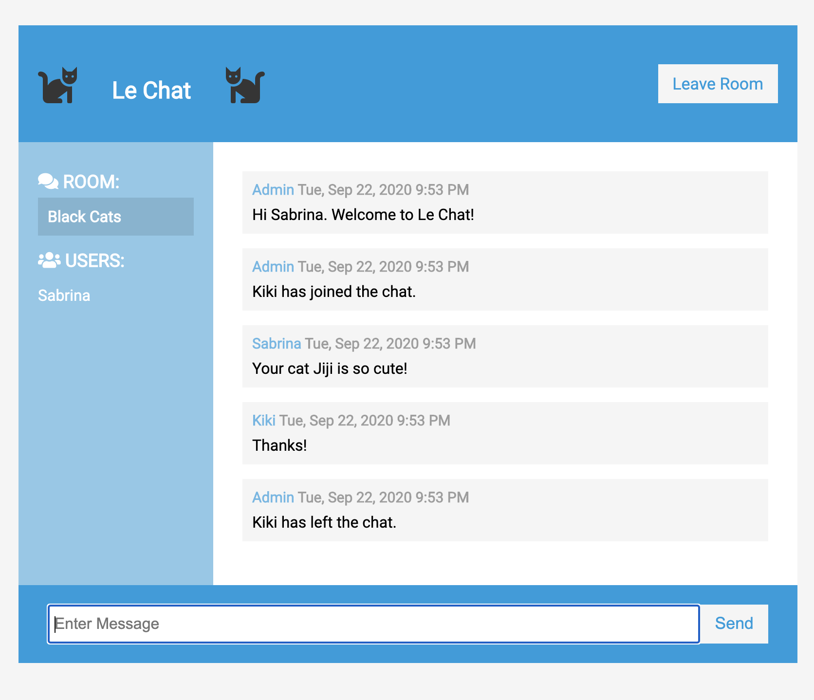
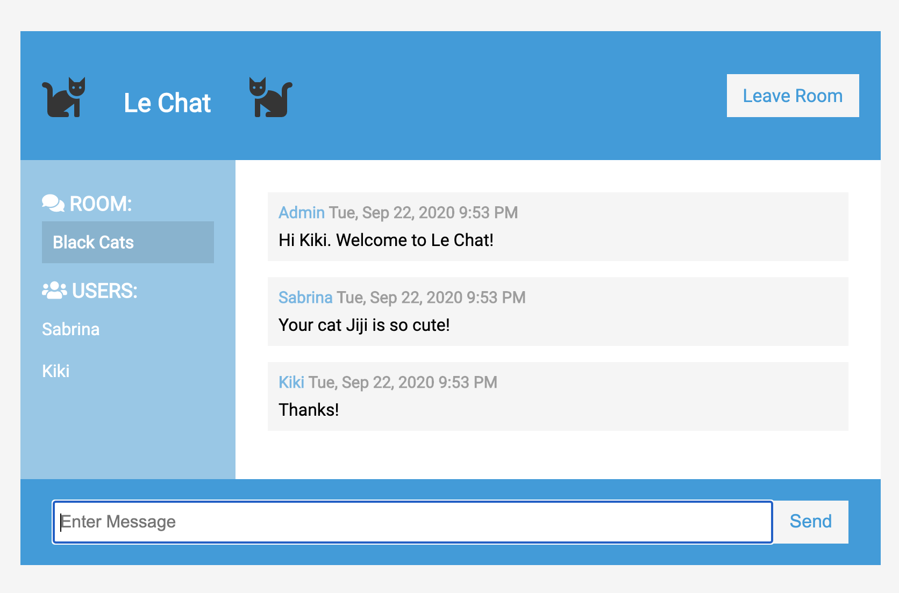

# LE CHAT

Le Chat is a chat app that allows users to communicate in realtime. 

USER STORIES:  
User can join a chat room  
User can leave a chat room  
User can send messages  
User can see other users join or leave the chat room  

## Technologies

HTML5, CSS3, JavaScript, [Socket.IO](https://socket.io/), Node.js, Express.js, [Moment.js](https://momentjs.com/)  





## Installation

1. Clone this repo and cd into the folder in the terminal.  

```  
git clone <repo url>  
cd le-chat 
```  

2. Install dependencies by running:
```  
npm install
```  

3. Load the app by running:
```  
npm run start
```  

## Usage
1. Open localhost:3000 in two or more browser windows to mimic multiple users.  
2. In each user's window, enter a name, select the same chat room, and click **Join Chat**. Each user's name will appear on the left sidebar and all users in the chat room will be notified when a new user joins the chat.  
3. In each user's window, enter a message and click **Send**. All users in the chat room will see the message.  
4. To leave a chat room, click **Leave Room**. All users in the room will be notified after a user leaves the chat.  
